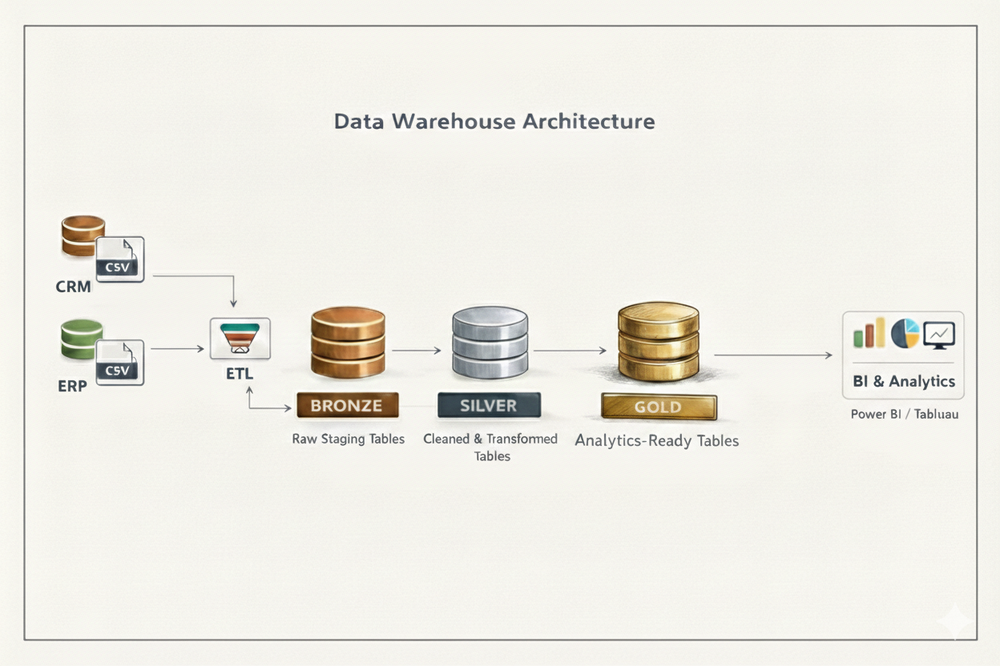

# 🚀 Advance SQL Project : Data Warehousing + EDA +  Data Analytics



A complete, end-to-end **SQL-driven Data Warehouse & Analytics Project**, covering:

- **Data Modeling & ETL Pipeline (Bronze → Silver → Gold)**
- **Data Cleaning, Standardization & Transformation**
- **EDA + Advanced SQL Analytics**
- **Customer & Product Reporting**
- **Business Insights & KPI Generation**

This project simulates a **real industry-grade data engineering + business analytics workflow**, starting from raw ERP & CRM datasets and delivering production-ready insights using SQL.

        


---

# 🧩 Business Problem

> 🏪 **Retail Company Issue:**  
> Data scattered across ERP & CRM → no unified reporting → poor insights → inconsistent decisions.

You built a scalable **Data Warehouse + Analytics System** to solve:

- Scattered data  
- Inconsistent formats  
- No single source of truth  
- No customer or product performance tracking  
- No advanced reporting  

The result is a **clean, scalable, analytics-ready warehouse**.

---
# 📥 Clone This Repository
```
git clone https://github.com/Harsh-Belekar/Advance-SQL-Project-Data-Warehousing-EDA-Advanced-Data-Analytics.git
cd Advance-SQL-Project-Data-Warehousing-EDA-Advanced-Data-Analytics
```

---

# 🏁 How to Run This Project

### 1. Initialize the Database
```
00_init_database.sql
```

### 2. Load Bronze Layer
```
proc_load_bronze.sql
```

### 3. Load Silver Layer
```
proc_load_silver.sql
```

### 4. Create Gold Layer
```
ddl_gold.sql
```

### 5. Run Analysis Scripts (00 → 12)
```
EDA + Advanced Data Analysis/scripts/
```
---

# 🚀 Project Overview

This repository showcases a full **SQL Data Engineering + Analytics workflow**, similar to real-world industry projects.

### 🧱 Data Warehouse Development
- Implemented **Bronze → Silver → Gold** layers
- Built automated ETL using **SQL stored procedures**
- Designed analytics-ready **Fact & Dimension tables**
- Performed validation checks and created documentation

### 📊 EDA + Advanced Analytics
- Used advanced SQL techniques for:
  - Ranking
  - Segmentation
  - Trend / change-over-time analysis
  - Cumulative KPI calculations

### 📑 Reporting Deliverables
- Customer Analytics Report
- Product Performance Report

---

### 🔍 Summary: 
This project builds a complete SQL Data Warehouse (Bronze → Silver → Gold) and performs advanced EDA + analytics to generate customer and product insights for a retail business.

---

# 🏗️ Project Architecture & Diagrams

# 📌 Overall Architecture  


# 🕸 Mesh Architecture Layers  


# 🔗 Data Integration Workflow  


# 🔄 Data Flow Diagram  


# 🧩 Star Schema Data Model  


---

# 🏗️ Tech Stack

| Layer | Tools Used |
|------|------------|
| Data Warehouse | PostgreSQL / SQL |
| Data Modeling | Star Schema, Dimensional Modeling |
| ETL Pipeline | SQL Stored Procedures |
| EDA & Analytics | SQL (Window functions, Aggregations, CTEs) |
| Documentation | Markdown, PNG diagrams |
 
---

# 🗂️ Project Folder Structure

```
Advance-SQL-Project-Data-Warehousing-EDA-Advanced-Data-Analytics/
│
│── 📄 README.md                               ← Main Project Documentation
│── 📑 LICENSE                                  ← License for Project
│
├── 🧱 Data Warehouse/
│   │
│   ├── scripts/                                ← ETL Scripts for Bronze → Silver → Gold
│   │   ├── bronze/
│   │   │   ├── ddl_bronze.sql                  ← Create Bronze Layer Tables
│   │   │   └── proc_load_bronze.sql            ← Load Raw ERP + CRM Data into Bronze
│   │   │
│   │   ├── silver/
│   │   │   ├── ddl_silver.sql                  ← Create Cleaned Silver Layer Tables
│   │   │   └── proc_load_silver.sql            ← Transform Bronze → Silver
│   │   │
│   │   └── gold/
│   │       └── ddl_gold.sql                    ← Create Final Fact & Dimensions (DW)
│   │
│   ├── tests/                                  ← Data Quality & Validation Scripts
│   │   ├── quality_checks_gold.sql             ← Gold Layer Validation Tests
│   │   └── quality_checks_silver.sql           ← Silver Layer Validation Tests
│   │
│   ├── docs/                                   ← Architecture, Models & Pipeline Diagrams
│   │   ├── Analysing Source System.png         ← Source System Exploration
│   │   ├── data_architecture.png               ← Full Data Architecture Overview
│   │   ├── data_catalog.md                     ← Documentation for All Tables & Columns
│   │   ├── data_flow.png                       ← End-to-End Data Flow Diagram
│   │   ├── data_integration.png                ← ERP + CRM Integration Overview
│   │   ├── data_layers.pdf                     ← Bronze, Silver, Gold Explanation
│   │   ├── data_model.png                      ← Data Warehouse Star Schema
│   │   ├── ETL.png                             ← ETL Pipeline Overview
│   │   ├── Mesh_Architecture_Layers.png        ← Data Mesh Architecture Layers
│   │   └── naming_conventions.md               ← Standards for Naming Tables & Columns
│   │
│   └── row_dataset/                            ← Raw ERP & CRM Source System Data
│       ├── source_erp/
│       │   ├── CUST_AZ12.csv                   ← ERP Customer Data
│       │   ├── LOC_A101.csv                    ← ERP Location Data
│       │   └── PX_CAT_G1V2.csv                 ← ERP Product/Category Data
│       │
│       └── source_crm/
│           ├── cust_info.csv                   ← CRM Customer Info
│           ├── prd_info.csv                    ← CRM Product Info
│           └── sales_details.csv               ← CRM Sales Transactions
│
└── 📊 EDA + Advanced Data Analysis/
    │
    ├── Data Analysis .png                       ← EDA Output Summary Diagram
    │
    ├── scripts/                                 ← All SQL Scripts for Analysis
    │   ├── 00_init_database.sql                 ← Initialize Analysis Schema
    │   ├── 01_database_exploration.sql          ← Explore Tables & Metadata
    │   ├── 02_dimensions_exploration.sql        ← Explore Dimension Tables
    │   ├── 03_date_range_exploration.sql        ← Explore Date Ranges
    │   ├── 04_measures_exploration.sql          ← Explore Key Business Metrics
    │   ├── 05_magnitude_analysis.sql            ← Magnitude-Level Analysis
    │   ├── 06_ranking_analysis.sql              ← Ranking & Ordering Analysis
    │   ├── 07_change_over_time_analysis.sql     ← Trend + Time-Based Analysis
    │   ├── 08_cumulative_analysis.sql           ← Running Totals & Rolling Sums
    │   ├── 09_performance_analysis.sql          ← Performance & KPI Insights
    │   ├── 10_part_to_whole_analysis.sql        ← Proportional Contribution Analysis
    │   ├── 11_data_segmentation.sql             ← Customer & Product Segmentation
    │   ├── 12_report_customers.sql              ← Generate Customer Report (Gold Layer)
    │   └── 12_report_products.sql               ← Generate Product Report (Gold Layer)
    │
    └── dataset/                                 ← Output Reports from Gold Layer
        ├── gold.dim_customers.csv               ← Cleaned Customer Dimension
        ├── gold.dim_products.csv                ← Cleaned Product Dimension
        ├── gold.fact_sales.csv                  ← Cleaned Fact Sales Table
        ├── gold.report_customers.csv            ← Final Customer Analytics Report
        └── gold.report_products.csv             ← Final Product Analytics Report
```

---

# 📦 Project Deliverables (Final Output)

| Output File | Description |
|------------|-------------|
| `gold.fact_sales.csv` | Final fact table for sales transactions |
| `gold.dim_customers.csv` | Clean customer dimension |
| `gold.dim_products.csv` | Clean product dimension |
| `gold.report_customers.csv` | Customer segmentation + KPI report |
| `gold.report_products.csv` | Product performance + KPI report |

---


# 📈 Key Outcomes

- Built a fully functional SQL Data Warehouse  
- Designed & implemented ETL pipelines  
- Performed advanced SQL analytics  
- Designed star schema (Fact + Dimensions)  
- Developed customer & product analytical reports  
- Demonstrated real-world Data Engineer + Analyst workflow  

---

# ⭐ Project Highlights (for Resume / Portfolio)

- Real-world **Data Engineering + Analytics** workflow  
- End-to-end SQL project (**Data Warehousing + EDA + Advanced Data Analysis**)
- Realistic **ETL + Data Modeling** experience  
- Clean architecture & documentation  
- Retail analytics insights  
- Strong **Analytics + Business Insights** generation  
- Showcases SQL expertise at scale


---
# 🧑‍💻 Author

**👤 Nayan Mishra**  
📍 Data Analyst | Python Developer | SQL | Power BI | Excel | Data Visualization  
📬 [LinkedIn](https://www.linkedin.com/in/) | 🔗[GitHub](https://github.com/)

---

⭐ *If you found this project helpful, feel free to star the repo and connect with me for collaboration!*
